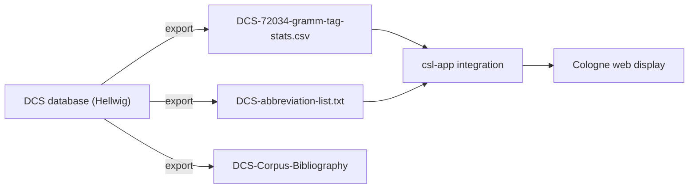
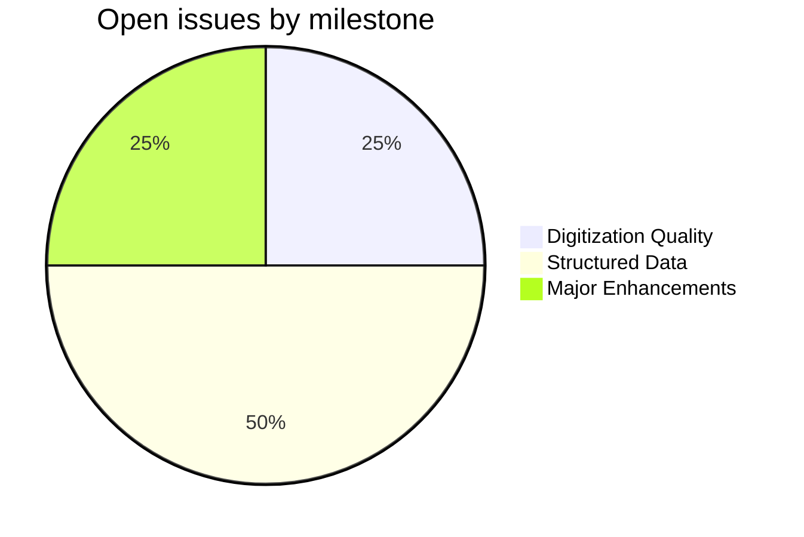
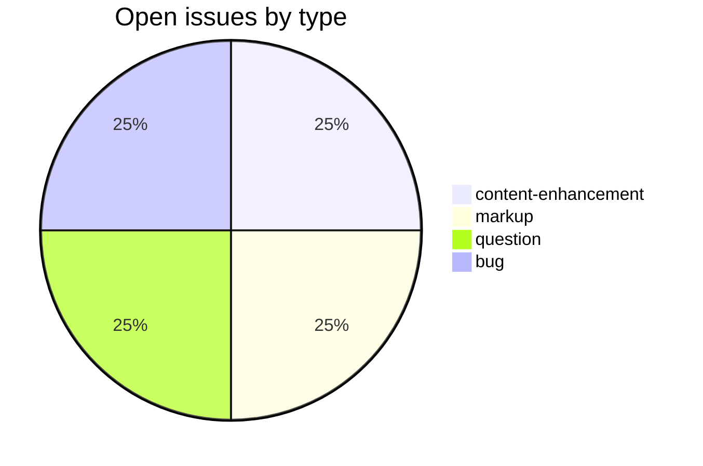

# DCS

_Created: 15-05-2026 · Last updated: 11-07-2026_

Reference data repository for the [Digital Corpus of Sanskrit (DCS)](http://kjc-fs-cluster.kjc.uni-heidelberg.de/dcs/), part of the [Cologne Digital Sanskrit Lexicons](https://www.sanskrit-lexicon.uni-koeln.de/) project. This repository holds the DCS abbreviation list, corpus bibliography, and grammatical-tag statistics used by the Cologne display infrastructure to resolve `<ls>` citation tags and validate grammar codes across Sanskrit dictionaries.

## Contents

| File | Description |
|---|---|
| [DCS-abbreviation-list.txt](https://github.com/sanskrit-lexicon/DCS/blob/main/DCS-abbreviation-list.txt) | Tab-separated DCS text abbreviations (full title → short code), "Gasuns edition" header |
| [DCS-Corpus-Bibliography](https://github.com/sanskrit-lexicon/DCS/blob/main/DCS-Corpus-Bibliography) | Free-text bibliography of DCS corpus texts |
| [DCS-72034-gramm-tag-stats.csv](https://github.com/sanskrit-lexicon/DCS/blob/main/DCS-72034-gramm-tag-stats.csv) | Semicolon-delimited `#;Word;GRAM` table, ~78,761 numbered word–grammar-tag rows (the filename encodes an earlier 72,034-word count) |
| [DATA_DICTIONARY.md](https://github.com/sanskrit-lexicon/DCS/blob/main/DATA_DICTIONARY.md) | Schema documentation for the CSV and abbreviation files |
| [CITATION.cff](https://github.com/sanskrit-lexicon/DCS/blob/main/CITATION.cff) | Citation metadata (cff 1.2.0, CC BY-SA 4.0) |
| [CONTRIBUTING.md](https://github.com/sanskrit-lexicon/DCS/blob/main/CONTRIBUTING.md) | Contribution guidelines |
| [CODE_OF_CONDUCT.md](https://github.com/sanskrit-lexicon/DCS/blob/main/CODE_OF_CONDUCT.md) | Contributor Covenant 2.1 |
| [CLAUDE.md](https://github.com/sanskrit-lexicon/DCS/blob/main/CLAUDE.md) | Repo-specific conventions for automated agents |

## Source

- **Creator**: Oliver Hellwig
- **Title**: *Digital Corpus of Sanskrit (DCS)*
- **URL**: [kjc-fs-cluster.kjc.uni-heidelberg.de/dcs/](http://kjc-fs-cluster.kjc.uni-heidelberg.de/dcs/)
- **Institution**: Cluster of Excellence "Asia and Europe in a Global Context", Heidelberg University
- **Data exported**: parsed words with grammatical tags, plus abbreviation and bibliography lists
- **License**: [CC BY-SA 4.0](https://github.com/sanskrit-lexicon/DCS/blob/main/LICENSE)

## Correction pattern

Unlike the printed-dictionary repos in this org, DCS holds tabular reference data (no compiled XML), so the [csl-orig correction workflow](https://github.com/sanskrit-lexicon/csl-corrections/blob/main/docs/correction-workflow.md) and its `updateByLine.py` change-file mechanism do not apply here — there is nothing to re-derive an XML build from. Corrections are made directly to the data file in a branch and delivered by pull request, per [CLAUDE.md § Correction Pattern](https://github.com/sanskrit-lexicon/DCS/blob/main/CLAUDE.md).

A real line from [DCS-abbreviation-list.txt](https://github.com/sanskrit-lexicon/DCS/blob/main/DCS-abbreviation-list.txt) (tab-separated title → code):

```
Amaraughaśāsana	AmŚā
```

To fix a mis-mapped abbreviation, edit the line directly and open a PR that states the issue number in its body:

```diff
- Amaraughaśāsana	AmŚā
+ Amaraughaśāsana	AmŚāsana
```

## How it works



## Encoding

- UTF-8 NFC throughout.
- Sanskrit words in IAST/ISO-15919 transliteration in the CSV and abbreviation list.
- Grammar codes follow the DCS internal schema; alien/unknown tags are tracked under the `encoding` and `question` issue labels.
- Round-trip between DCS grammar codes and Cologne SLP1 is handled at integration time by `csl-app`.

## Projects & Milestones

As of 11-07-2026 there are **4 open issues and no closed issues**. (Numbers #5–#9 are merged pull requests — Dependabot bumps and a docs PR — not issues; do not count them here.)

| Milestone | Open | Closed | Total |
|---|---|---|---|
| Dictionary to Book | 0 | 0 | 0 |
| Digitization Quality | 1 | 0 | 1 |
| Structured Data | 2 | 0 | 2 |
| Major Enhancements | 1 | 0 | 1 |
| **Total** | **4** | **0** | **4** |



## Issue Typology

### Open issues

| # | Title | Type | Severity | Milestone |
|---|---|---|---|---|
| [#4](https://github.com/sanskrit-lexicon/DCS/issues/4) | Hellwig's Normalized Lexical Information (1/3 MW) | content-enhancement | hard | Major Enhancements |
| [#3](https://github.com/sanskrit-lexicon/DCS/issues/3) | Abbreviations of text-names | markup | medium | Structured Data |
| [#2](https://github.com/sanskrit-lexicon/DCS/issues/2) | Alien Word Grammar Tags (djan vs. djma) | question | minor | Structured Data |
| [#1](https://github.com/sanskrit-lexicon/DCS/issues/1) | Duplicate Words (with Multiple Grammar Tags) | bug | minor | Digitization Quality |

### Closed issues

None yet.

### Open issues by type



The full org issue taxonomy (type labels, severities, milestone assignment) is documented in the [Cologne issue runbook](https://github.com/sanskrit-lexicon/csl-observatory/blob/main/runbook/cologne-tooling-runbook.md).

## Contributors

- [Oliver Hellwig](https://github.com/OliverHellwig) — original DCS dataset
- [Cologne Digital Sanskrit Lexicon contributors](https://www.sanskrit-lexicon.uni-koeln.de/) — integration and issue triage

_Dr. Mārcis Gasūns_
