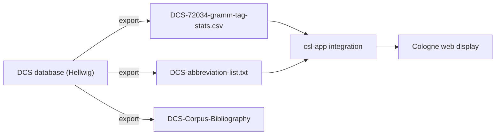
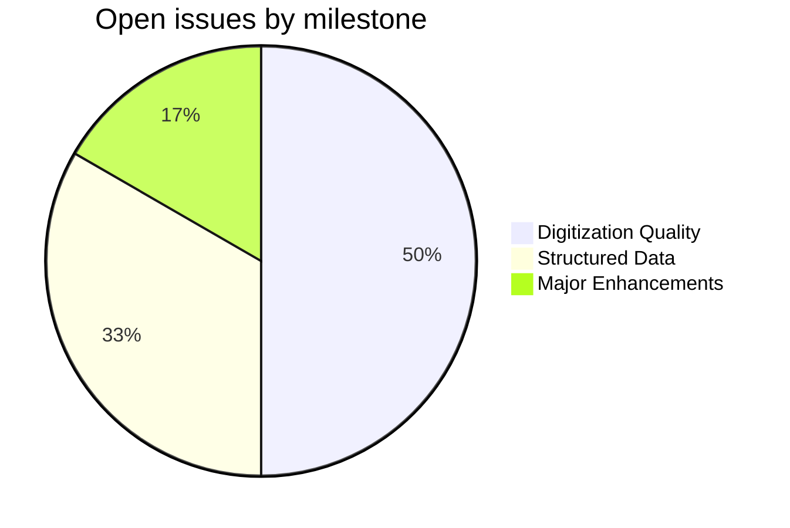
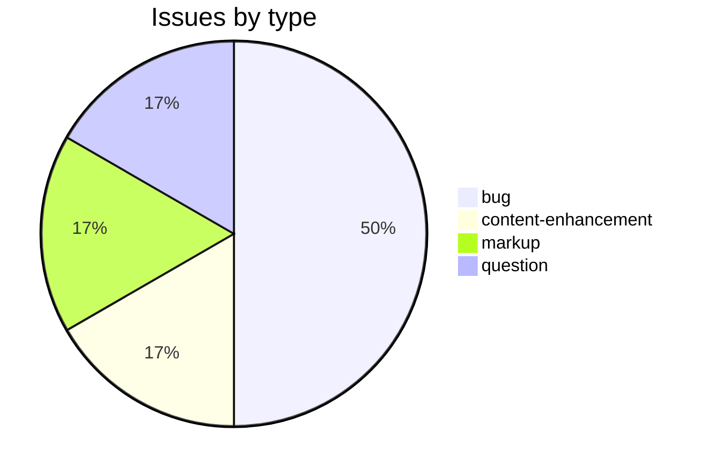

# DCS

Reference data repository for the [Digital Corpus of Sanskrit](http://kjc-fs-cluster.kjc.uni-heidelberg.de/dcs/) (DCS), part of the [Cologne Digital Sanskrit Lexicons](https://www.sanskrit-lexicon.uni-koeln.de/) project. This repository holds the DCS abbreviation list, corpus bibliography, and grammatical-tag statistics used by the Cologne display infrastructure to resolve `<ls>` citation tags and validate grammar codes across Sanskrit dictionaries.

## Contents

| File / Directory | Description |
|---|---|
| `DCS-abbreviation-list.txt` | Tab-separated DCS text abbreviations (full title → short code) |
| `DCS-Corpus-Bibliography` | Free-text bibliography of DCS corpus texts |
| `DCS-72034-gramm-tag-stats.csv` | ~78 000 word–grammar-tag pairs exported from DCS |
| `CITATION.cff` | Software citation metadata (cff 1.2.0, CC BY-SA 4.0) |
| `DATA_DICTIONARY.md` | Schema documentation for CSV and abbreviation files |
| `CONTRIBUTING.md` | Contribution guidelines |
| `CODE_OF_CONDUCT.md` | Contributor Covenant 2.1 |

## Source

- **Creator**: Oliver Hellwig
- **Title**: *Digital Corpus of Sanskrit (DCS)*
- **URL**: <http://kjc-fs-cluster.kjc.uni-heidelberg.de/dcs/>
- **Institution**: Cluster of Excellence "Asia and Europe in a Global Context", Heidelberg University
- **Data exported**: ~72 034 parsed words with grammatical tags, plus abbreviation and bibliography lists
- **License**: CC BY-SA 4.0

## How it works

## Encoding

- UTF-8 NFC throughout.
- Sanskrit words in IAST transliteration (ISO 15919) in the CSV and abbreviation list.
- Grammar codes follow the DCS internal schema; alien/unknown tags are tracked under the `encoding` issue label.
- Round-trip between DCS grammar codes and Cologne SLP1 is handled at integration time by `csl-app`.

## Projects & Milestones

| Milestone | Open | Closed | Total |
|---|---|---|---|
| Dictionary to Book | 0 | 0 | 0 |
| Digitization Quality | 3 | 0 | 3 |
| Structured Data | 2 | 0 | 2 |
| Major Enhancements | 1 | 0 | 1 |
| **Total** | **6** | **0** | **6** |

## Issue Typology

### Open issues

| # | Title | Type | Severity | Milestone |
|---|---|---|---|---|
| [#6](https://github.com/sanskrit-lexicon/DCS/issues/6) | build(deps): bump actions/setup-python from 5 to 6 | bug | minor | Digitization Quality |
| [#5](https://github.com/sanskrit-lexicon/DCS/issues/5) | build(deps): bump actions/checkout from 4 to 6 | bug | minor | Digitization Quality |
| [#4](https://github.com/sanskrit-lexicon/DCS/issues/4) | Hellwig's Normalized Lexical Information (1/3 MW) | content-enhancement | hard | Major Enhancements |
| [#3](https://github.com/sanskrit-lexicon/DCS/issues/3) | Abbreviations of text-names | markup | medium | Structured Data |
| [#2](https://github.com/sanskrit-lexicon/DCS/issues/2) | Alien Word Grammar Tags (djan vs. djma) | question | minor | Structured Data |
| [#1](https://github.com/sanskrit-lexicon/DCS/issues/1) | Duplicate Words (with Multiple Grammar Tags) | bug | minor | Digitization Quality |

### Closed issues

None yet.

### Issue types (all issues)

## Labels

### Type labels

| Label | Color | Meaning |
|---|---|---|
| `link-target` | `#0075ca` | Building click-throughs from `<ls>` abbreviations to PDFs |
| `link-splitting` | `#0075ca` | Splitting combined source refs into individual per-page links |
| `markup` | `#0075ca` | Normalising XML tag content |
| `text-correction` | `#0075ca` | Corrections to definitions or headwords |
| `content-enhancement` | `#0075ca` | New material or display upgrades |
| `encoding` | `#0075ca` | Transcoding, character rendering, dash normalisation |
| `scan-quality` | `#0075ca` | Replacing blurry or missing scan pages |
| `bug` | `#0075ca` | Broken links, XML errors, duplicate entries |
| `question` | `#0075ca` | Scholarly questions requiring research |

### Severity labels

| Label | Color | Meaning |
|---|---|---|
| `minor` | `#e4e669` | Targeted, self-contained fix |
| `medium` | `#fbca04` | Standard unit of work — one batch of corrections |
| `hard` | `#d93f0b` | Large effort spanning many sources or files |

## Contributors

- [Oliver Hellwig](https://github.com/OliverHellwig) — original DCS dataset
- [Cologne Digital Sanskrit Lexicon contributors](https://www.sanskrit-lexicon.uni-koeln.de/) — integration and issue triage

---
*Updated by Cologne Issue Runbook — 2026-05-29*
